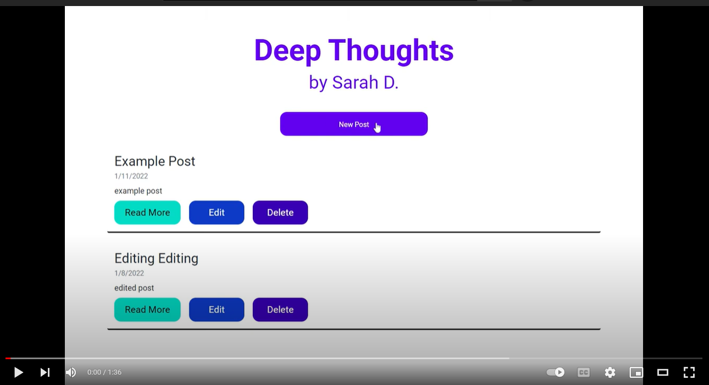

# markdown-blog
Blog built using Node.js, Express, MongoDB, and EJS.
The user can create a new post, edit the new post, or delete the post. The user can view all posts in descending order by date.

### App deployed at:
https://node-mongo-express-app.herokuapp.com/

## Developer: 
Sarah DeMercurio

Inspired by the blog created by WebDev Simplified